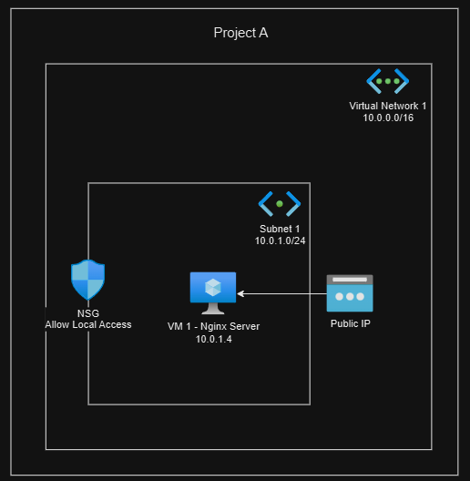

# Project A: Basic VN and Subnet, NSG

## Description

- This project mainly to learn how to setup Virtual Network, Subnet, and configure Network Security Group (NSG).
- It could be using Terraform or OpenTofu to provision this project.
- Nginx server would be setup automatically with proper NSG configured which accessible from your local machine.

## Architecture



## Prerequisite

1. Please export your `ARM_SUBSCRIPTION_ID` to your terminal. This is your subscription ID from Azure Portal.

    ```bash
        export ARM_SUBSCRIPTION_ID=<Subscription ID from Azure Portal>
    ```

## Deployment Steps

```bash
# Go into /deployment directory
cd ./Project_A/deployment

# Init with Terraform/OpenTofu
terraform init -upgrade

# Plan the modules
terraform plan

# Apply the modules
terraform apply
```

## Outcomes

1. You may find VM public and private IPs outputed.
2. You may try to ping or SSH to the VM using the public IPs, ssh private key located in `~/.ssh`.

    ```bash
        # Ping the VM
        ping <public IP>

        # SSH to the VM
        ssh -i ~/.ssh/azure_vm_personal adminuser@<public IP>
    ```

3. Browse the Nginx default main page in any browser by just type in the `<public IP>`

## Destroy Deployment

- Destroy when you wish to destroy the deployment

    ```bash
        terraform destroy -auto-approve
    ```
