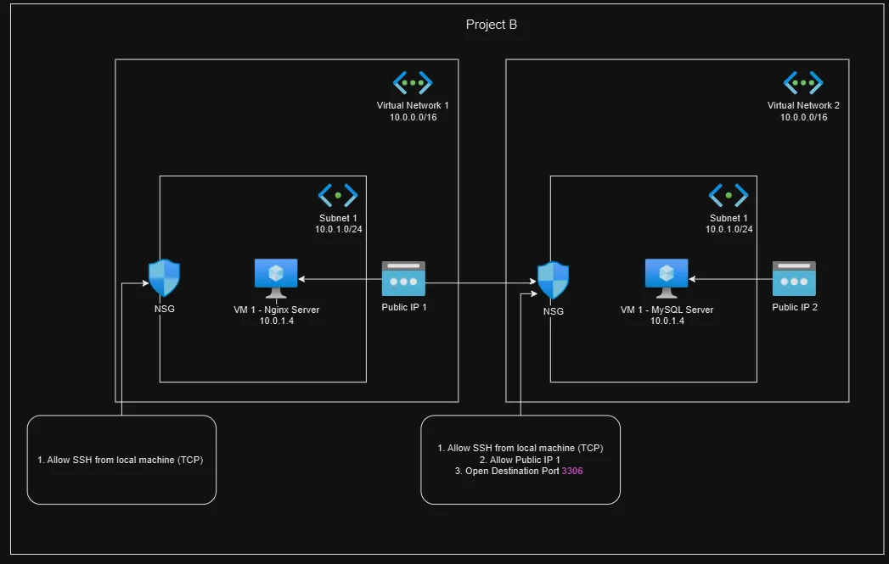

# Project B: Communication of Nginx & MySQL Remote Server in 2 VN and Subnet, NSG

## Description

- This project mainly to learn how 2 Virtual Machine communicated through Public IP when they are located in 2 different Virtual Network.
- It could be using Terraform or OpenTofu to provision this project.
- Nginx and MySQL server would be setup automatically with proper Network Security Group configured which accessible from your local machine.

## Architecture



## Prerequisite

1. Please export your SUBSCRIPTION_ID to your terminal

    ```bash
        export ARM_SUBSCRIPTION_ID=<Subscription ID from Azure Portal>
    ```

## Deployment Steps

```bash
# Go into /deployment directory
cd ./Project_B/deployment

# Init with Terraform/OpenTofu
terraform init -upgrade

# Plan the modules
terraform plan

# Apply the modules
terraform apply
```

## Outcomes

1. You may find VM public and private IPs outputed.
2. You may try to ping or SSH to the VM using the public IPs, ssh private key located in `~/.ssh`.

    ```bash
        # Ping the VM
        ping <public IP>

        # SSH to the MySQL VM
        ssh -i ~/.ssh/azure_vm_personal_nginx adminuser@<public IP>
    ```

3. Use the Nginx VM to connect to MySQL server with command.

    ```bash
        # SSH to the Nginx VM
        ssh -i ~/.ssh/azure_vm_personal_nginx adminuser@<public IP>

        # Connect to MySQL VM, user and password are set by default for learning purpose
        # ID: testUser
        # Password: test123
        mysql -u testUser -p -h <MySQL server Public IP>

        # Create a simple database and table
        CREATE DATABASE testDB;

        USE testDB;

        CREATE TABLE my_table (
            id INT PRIMARY KEY AUTO_INCREMENT,
            name VARCHAR(50) NOT NULL,
            email VARCHAR(100) UNIQUE
        );
    ```

4. Connect to MySQL server and ensure the table is created successfully.

    ```bash
        # SSH to the MySQL VM
        ssh -i ~/.ssh/azure_vm_personal_mysql adminuser@<public IP>

        # Connect with MySQL just for verify purpose
        sudo mysql

        # Create a simple database and table
        USE testDB;

        SHOW TABLES;
    ```

## Destroy Deployment

- Destroy when you wish to destroy the deployment

    ```bash
        terraform destroy -auto-approve
    ```
