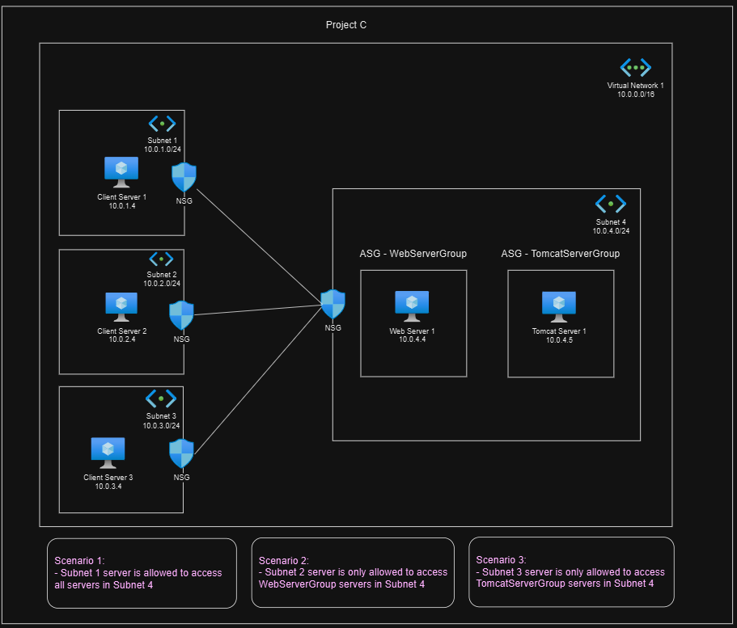

# Project C: Network & Application Security Group

## Description

- This project mainly to learn Network & Application Security Group of Azure.

- It could be using Terraform or OpenTofu to provision this project.

- Nginx and Tomcat server would be setup automatically with proper Network & Application Security Group configured which accessible from your local machine.

## Architecture



## Architecture Explaination

- A virtual network consists of 4 different subnets with VMs where these instances in Subnet 1, 2 and 3 would communicate with instances in Subnet 4.

- By default, all VMs are <ins>__NOT__</ins> able to communicate with each other.

- All VMs are able to __Ping__ and __SSH__ from your local machine.

- Only VMs label with Tomcat in Subnet 4 has port 8080 opened for viewing Tomcat default page.

## Scenarios

1. Subnet 1 server is allowed to access all servers in Subnet 4.
2. Subnet 2 server is only allowed to access WebServerGroup servers in Subnet 4.
3. Subnet 3 server is only allowed to access TomcatServerGroup servers in Subnet 4.

## Prerequisite

1. Please export your SUBSCRIPTION_ID to your terminal.

    ```bash
        export ARM_SUBSCRIPTION_ID=<Subscription ID from Azure Portal>
    ```

## Deployment Steps

```bash
# Go into /deployment directory
cd ./Project_C/deployment

# Init with Terraform/OpenTofu
terraform init -upgrade

# Plan the modules
terraform plan

# Apply the modules
terraform apply
```

## Outcomes

1. You may find all VMs public and private IPs outputed.
2. You may try to ping or SSH to the VM using the public IPs, ssh private key located in `~/.ssh`.

    ```bash
        # Ping the VM
        ping <public IP>

        # SSH to the MySQL VM
        ssh -i ~/.ssh/<private key file> adminuser@<public IP>
    ```

3. Private Key Files Name
    - azure_vm_personal_subnet-1-client_1
    - azure_vm_personal_subnet-2-client_2
    - azure_vm_personal_subnet-3-client_3
    - azure_vm_personal_subnet-4-tomcat
    - azure_vm_personal_subnet-4-webserver

4. You may play around with the VMs by SSH into it and use `curl` to get Nginx main page based on the scenario setup.

    ```bash
        ssh -i ~/.ssh/<private key file> adminuser@<public IP>

        # If you are SSH to VMs in Subnet 1, you will get Nginx page, because 10.0.1.4 consider localhost
        curl 10.0.1.4

        # This would not be working since NSG is blocking it
        curl 10.0.2.4

        # Etc...
    ```

5. Test for getting Tomcat default page based on <ins>__scenario 3__</ins>.

    ```bash
        ssh -i ~/.ssh/azure_vm_personal_subnet-3-client_3 adminuser@<subnet 3 VM public IP>

        # Get Tomcat default page
        curl <Tomcat Server private IP>:8080

        # Unable to get response from WebServer VM
        curl <Web Server private IP>
    ```

## Notes Takeaway

1. We are able to mix of IP addresses with Application Security Group. Check `/Project_C/deployment/main.tf`

2. Application Security Group attached VM's NIC (Network Interface Card) layer.

3. Network Security Group could attached at Subnet's (Preferrable) and NIC layer.

## Destroy Deployment

```bash
# Destroy when you wish to destroy the deployment
terraform destroy -auto-approve
```
