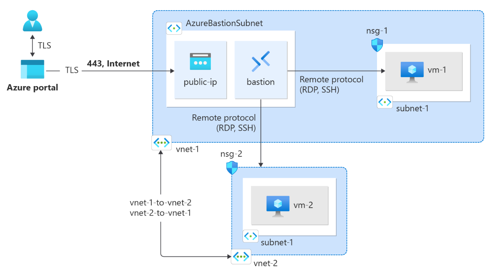
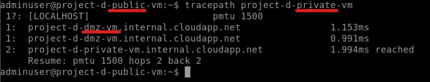
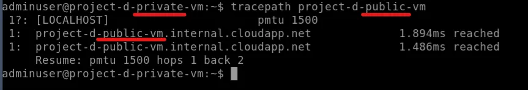
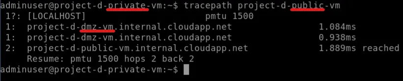

# Project E: Prviate Link

## Description

- This project mainly to learn Bastion & Route Table of Azure.
- It could be using Terraform or OpenTofu to provision this project.
- This project is refer to [Azure Tutorial](https://learn.microsoft.com/en-us/azure/virtual-network/tutorial-create-route-table-portal).

## Architecture



## Architecture Explaination

- A virtual network consists of 4 different subnets and 3 VM would be created.
  - Bastion Subnet: Dedicated use for Bastion Only
  - DMZ Subnet: Virtual Appliance Virtual Machine Located.
  - Private Subnet: Private Virtual Machine Located.
  - Public Subnet: Public Virtual Machine Located.

- Virtual Appliance VM enabled with __IP Forwarding__ to be as a middleware to route the traffic.

- Virtual Machine's Login ID is `adminuser` and Password `Admin_123`

## Scenarios

1. Use `tracepath` from public VM to private VM - With Custom Route Table Configured
    - Public VM will pass through Virtual Appliance VM and reach Private VM.
2. Use `tracepath` from private VM to public VM - Using Default Route Table
    - Private VM will reach Public VM without going through Virtual Appliance VM.
3. Use `tracepath` from private VM to public VM - With Custom Route Table Configured - __Additional Scenario__
    - Enable customer route table for Scenario 2.
    - Private VM will pass through Virtual Appliance VM and reach Public VM.

## Notes Takeaway

1. Route table
    - By default, it is configured by Azure automatically to each subnet. Check [official documentation](https://learn.microsoft.com/en-us/azure/virtual-network/virtual-networks-udr-overview) for more information.
2. Bastion Host
    - Bastion host needs to be located in a dedicated subnet name `AzureBastionSubnet` and with a dedicated subnet prefix, e.g. `10.0.1.0/26`
    - Bastion host is not a __~~Virtual Machine~~__, but a service provided by Azure, where each of the VM within the same Virtual Network is able connect by using it.
    - Bastion Host requires to attach a public IP for publicly accessible.
    - This is for security purpose and easier management.
    - It enabled with __RDP (Port 3389)__ and __SSH (22)__ to ensure secure connection.
    - Easier management based on we do not needs to manage couple of SSH Key while we have tons of Virtual Machine.

## Prerequisite

1. Please export your __SUBSCRIPTION_ID__ to your terminal.

    ```bash
        export ARM_SUBSCRIPTION_ID=<Subscription ID from Azure Portal>
    ```

## Deployment Steps

```bash
# Go into /deployment directory
cd ./Project_D/deployment

# Init with Terraform/OpenTofu
terraform init -upgrade

# Plan the modules
terraform plan

# Apply the modules
terraform apply
```

## Outcomes

1. First Scenario
    - Connect to Public VM via Bastion on Azure Portal.
    - Then use command below, you should see similar output as the image provided.

        ```bash
            tracepath project-d-private-vm
        ```

        

2. Second Scenario
    - Connect to Private VM via Bastion on Azure Portal.
    - Then use command below, you should see similar output as the image provided.

        ```bash
            tracepath project-d-public-vm
        ```

        

3. Third scenario
    - Disconnect from Private VM.
    - Then head over to [private.tf](./modules/private.tf) and uncomment the __TODO__ section.
    - Run `terraform apply` again.
    - Conenct to Private VM via Bastion again after apply complete.
    - Run command below, you should see similar output as the image provided.

    ```bash
        tracepath project-d-public-vm
    ```

    

## Destroy Deployment

- Destroy when you wish to destroy the deployment

    ```bash
        terraform destroy -auto-approve
    ```
