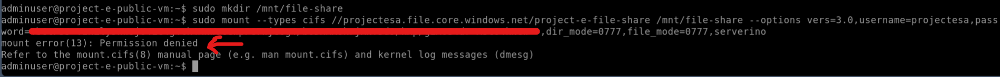

# Project E: Storage Account with Subnet Service Endpoint

## Description

- This project mainly to learn of connecting to Storage Account using Subnet Private Service Endpoint.
- It could be using Terraform or OpenTofu to provision this project.
- This project is refer to [Azure Tutorial](https://learn.microsoft.com/en-us/azure/virtual-network/tutorial-restrict-network-access-to-resources).

## Architecture


## Architecture Explaination

- A virtual network consists of 3 different subnets and 2 VM would be created.
  - Bastion Subnet: Dedicated use for Bastion Only.
  - Private Subnet: Private Virtual Machine Located.
  - Public Subnet: Public Virtual Machine Located.

- All Virtual Machine's Login ID is `adminuser` and Password `Admin_123`

## Scenarios

1. Enabled Service Endpoint to `Microsoft.StorageAccount` in Private Subnet.
    - This would allow virtual machine in Private Subnet allowed to access Storage Account.
    - Mount the File to the virtual machine in Private Subnet is allowed.
2. VM in Public Subnet is not able to access Storage Account since no Service Endpoint is enabled.
    - Mount the File to the virtual machine in Public Subnet is not allowed.

## Notes Takeaway

1. Available Service Endpoints - This may differ by region
    - Microsoft.Storage
    - Microsoft.Sql
    - Microsoft.AzureActiveDirectory
    - Microsoft.AzureCosmosDB
    - Microsoft.Web
    - Microsoft.KeyVault
    - Microsoft.EventHub
    - Microsoft.ServiceBus
    - Microsoft.ContainerRegistry
    - Microsoft.CognitiveServices
    - Microsoft.Storage.Global
2. When we enabled Service Endpoint from the above, the subnet would able to communicate to the Azure Services.
3. Storage Account by default accept all access from the public network. We need to disable (Set `default_action` to `Deny`) it and only allowed whether the `IP Address or Ranges` or `Virtual Network Subnet IDs` for security purpose.

## Prerequisite

1. Please export your __SUBSCRIPTION_ID__ to your terminal.

    ```bash
        export ARM_SUBSCRIPTION_ID=<Subscription ID from Azure Portal>
    ```

## Deployment Steps

```bash
# Go into /deployment directory
cd ./Project_E/deployment

# Init with Terraform/OpenTofu
terraform init -upgrade

# Plan the modules
terraform plan

# Apply the modules
terraform apply
```

## Outcomes

1. First Scenario
    - Connect to `Private VM` via Bastion on Azure Portal.
    - Then use command below, you should see similar output as the image provided.
    - `storage-account-name` would be outputted after deployment.
    - Get and Replace `storage-account-key` from Azure Portal: `Azure Portal -> Storage Account -> Security + networking -> Access Keys`. Then copy `key1 -> Key`.
    - Hint: Bastion using Clipboard API, to paste command below to the connected VM opened in browser, use `Shift + CTRL + V`

        ```bash
            sudo mkdir /mnt/file-share

            sudo mount --types cifs //projectesa.file.core.windows.net/project-e-file-share /mnt/file-share --options vers=3.0,username=projectesa,password=<storage-account-key>,dir_mode=0777,file_mode=0777,serverino
        ```

        

2. Second Scenario
    - Connect to `Public VM` via Bastion on Azure Portal.
    - Repeat what we have done in First Scenario, but permission denied should prompted, because we are not setting `Microsoft.Storage` service endpoint to Public Subnet.
    - Hint: Bastion using Clipboard API, to paste command below to the connected VM opened in browser, use `Shift + CTRL + V`

        ```bash
            sudo mkdir /mnt/file-share

            sudo mount --types cifs //projectesa.file.core.windows.net/project-e-file-share /mnt/file-share --options vers=3.0,username=projectesa,password=<storage-account-key>,dir_mode=0777,file_mode=0777,serverino
        ```

        

## Destroy Deployment

- Destroy when you wish to destroy the deployment

    ```bash
        terraform destroy -auto-approve
    ```

## Troubleshooting

- If you meet any issue, try to run `terraform apply` again and see if the issue resolved, else look for solution from the internet :)
