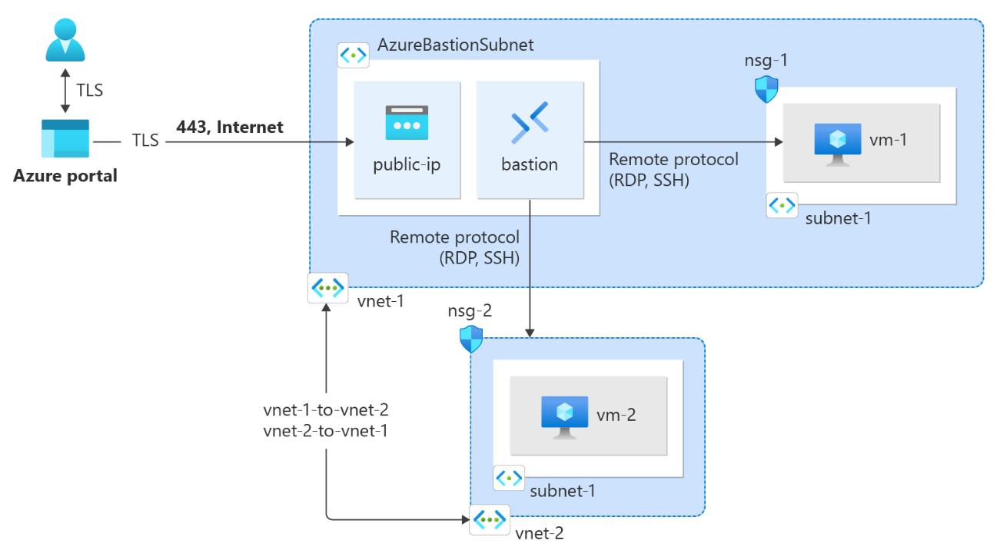
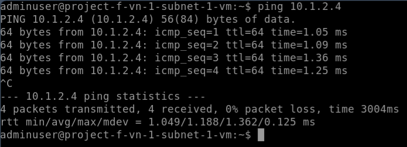
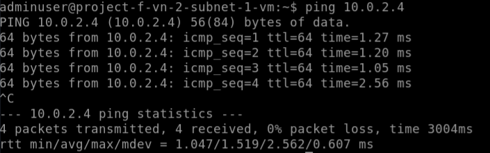

# Project F: Virtual Network Peering

## Description

- This project mainly to learn Virtual Network Peering.
- It could be using Terraform or OpenTofu to provision this project.
- This project is refer to [Azure Tutorial](https://learn.microsoft.com/en-us/azure/virtual-network/tutorial-connect-virtual-networks-portal).

## Architecture



## Architecture Explaination

- A virtual network consists of 2 different virtual network and 2 VM would be created in 2 subnet respectively.
  - Bastion Subnet: Dedicated use for Bastion Only.
  - Virtual Network 1 Subnet 1: Virtual Machine 1 Located.
  - Virtual Network 2 Subnet 2: Virtual Machine 2 Located.
  - Virtual Network Peering: From VN 1 Peered to VN 2.

- All Virtual Machine's Login ID is `adminuser` and Password `Admin_123`

## Scenarios

1. VM in Virtual Network 1 is able to ping VM in Virtual Network 2.
2. VM in Virtual Network 2 is able to ping VM in Virtual Network 1.

## Notes Takeaway

1. Azure supports 2 types of Virtual Network Peering:
    - Virtual Network Peering: For Virtual Network Peering within same Azure Regions. __(We are using this in this tutorial)__
    - Global Virtual Network Peering: For Virtual Network Peering across different Azure Regions.
2. After peering, communication between VMs are route through Private Network Only.
3. Benefits of Virtual Network Peering:
    - Low Latency with High Bandwidth
    - Ability of resources in one VN to communicate with other resources is another VN
    - Ability to transfer data between virtual networks across Azure subscriptions, Microsoft Entra tenants, deployment models, and Azure regions
        - To peer Virtual Network in another Azure Tenant, make sure you have sufficient privilege to it.
    - Ability to peer virtual network through Azure Resource Manager
    - No downtime to resources in either Virtual Network when creating the peering, or after peering is created.
4. Aware that the peering VN could not using the same address prefix. It will prompt with error of address overlapped.
    - E.g.: Virtual Network 1 has prefix `10.0.0.0/16`, then Virtual Network 2 must be different from it, such as using `10.1.0.0/16` is allowed.
5. By using Terraform/OpenTofu to setup VN Peering, we need to have bi-directional setup, or else it can't be fully synchronize
    - Check [peering.tf](./modules/peering.tf)

## Prerequisite

1. Please export your `ARM_SUBSCRIPTION_ID` to your terminal. This is your subscription ID from Azure Portal.

    ```bash
        export ARM_SUBSCRIPTION_ID=<Subscription ID from Azure Portal>
    ```

## Deployment Steps

```bash
# Go into /deployment directory
cd ./Project_F/deployment

# Init with Terraform/OpenTofu
terraform init -upgrade

# Plan the modules
terraform plan

# Apply the modules
terraform apply
```

## Outcomes

1. First Scenario
    - Connect to `VN 1 Subnet 1 VM` via Bastion on Azure Portal.
    - Then use command below, you should see similar output as the image provided.

        ```bash
            # Try to ping VM in Virtual Network 2
            ping -c 10.1.2.4
        ```

        

2. Second Scenario
    - Connect to `VN 2 Subnet 1 VM` via Bastion on Azure Portal.
    - Then use command below, you should see similar output as the image provided.

        ```bash
            # Try to ping VM in Virtual Network 1
            ping -c 10.0.2.4
        ```

        

## Destroy Deployment

- Destroy when you wish to destroy the deployment

    ```bash
        terraform destroy -auto-approve
    ```

## Known Issues

- According by Azure tutorial, we could ping the VM by using its name, but I could not achieve that. I have also tested manual way by following the tutorial, it still could not be achieved.
- Instead, I am using the VM's private IP and it is working, not sure about the cause. Feel free to open an `Issue` or `Pull Request` to discuss and resolve this issue :)
