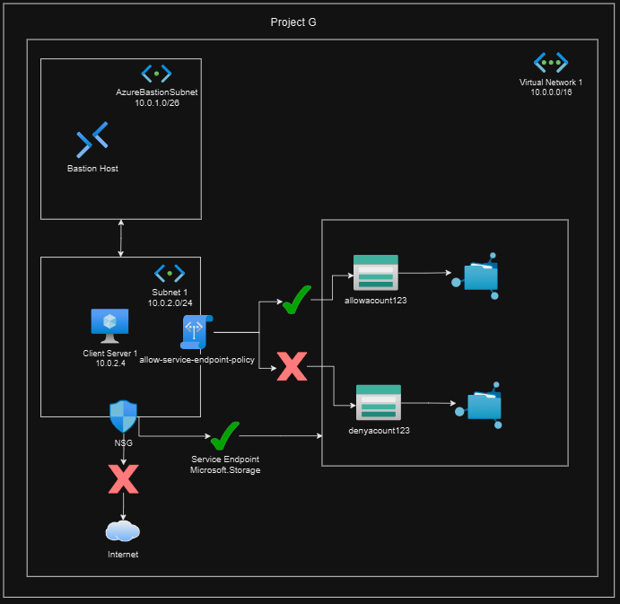
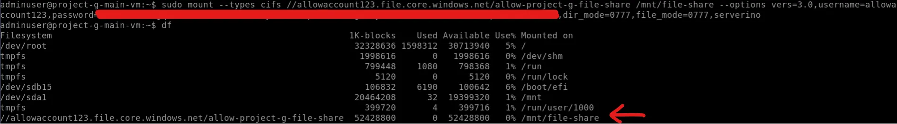
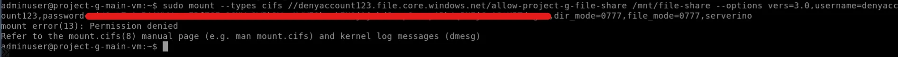

# Project G: Associate Subnet Service Endpoint Policies

## Description

- This project mainly to learn of control connection to Storage Account using Subnet Service Endpoint Storage Policy.
- It could be using Terraform or OpenTofu to provision this project.
- This project is refer to [Azure Tutorial](https://learn.microsoft.com/en-us/azure/virtual-network/virtual-network-service-endpoint-policies).

## Architecture



## Architecture Explaination

- A virtual network consists of 2 different subnets, 1 VM and 2 Storage Accounts would be created.
  - Bastion Subnet: Dedicated use for Bastion Only.
  - Main Subnet: Private Virtual Machine Located.
  - Storage Accounts: Allow_SA and Deny_SA.

- All Virtual Machine's Login ID is `adminuser` and Password `Admin_123`

## Scenarios

1. VM is able to access `Allow_SA` Storage Account since Subnet Service Endpoint Storage Policy is enabled.
    - Mount the File to the virtual machine from `Allow_SA` is allowed.
2. VM is not able to access `Deny_SA` Storage Account since no Subnet Service Endpoint Storage Policy is enabled.
    - Mount the File to the virtual machine from `Deny_SA` is not allowed.

## Notes Takeaway

1. Available Service Endpoints - This may differ by region
    - Microsoft.Storage
    - Microsoft.Sql
    - Microsoft.AzureActiveDirectory
    - Microsoft.AzureCosmosDB
    - Microsoft.Web
    - Microsoft.KeyVault
    - Microsoft.EventHub
    - Microsoft.ServiceBus
    - Microsoft.ContainerRegistry
    - Microsoft.CognitiveServices
    - Microsoft.Storage.Global
2. When we enabled Service Endpoint from the above, the subnet would able to communicate to the Azure Services.
3. Storage Account by default accept all access from the public network. We need to disable (Set `default_action` to `Deny`) it and only allowed whether the `IP Address or Ranges` or `Virtual Network Subnet IDs` for security purpose.
4. Using Subnet Service Endpoint Policy could control which Azure Service that the subnet is able to access and which is not.

## Prerequisite

1. Please export your __SUBSCRIPTION_ID__ to your terminal.

    ```bash
        export ARM_SUBSCRIPTION_ID=<Subscription ID from Azure Portal>
    ```

## Deployment Steps

```bash
# Go into /deployment directory
cd ./Project_G/deployment

# Init with Terraform/OpenTofu
terraform init -upgrade

# Plan the modules
terraform plan

# First Phase: to Apply the module
terraform apply

# Second Phase: After deploy the first phase, go to storage_account.tf to uncomment the TODO section, then apply again
terraform apply
```

## Outcomes

1. First Scenario
    - Connect to `Main VM` via Bastion on Azure Portal.
    - Then use command below, you should see similar output as the image provided.
    - `storage-account-name` would be outputted after deployment.
    - Get and Replace `storage-account-key` from Azure Portal: `Azure Portal -> Storage Account -> Security + networking -> Access Keys`. Then copy `key1 -> Key`.
    - Hint: Bastion using Clipboard API, to paste command below to the connected VM opened in browser, use `Shift + CTRL + V`

        ```bash
            sudo mkdir /mnt/file-share

            sudo mount --types cifs //allowaccount123.file.core.windows.net/allow-project-g-file-share /mnt/file-share --options vers=3.0,username=allowaccount123,password=<storage-account-key>,dir_mode=0777,file_mode=0777,serverino
        ```

        

2. Second Scenario
    - Connect to `Main VM` via Bastion on Azure Portal.
    - Repeat what we have done in First Scenario, but permission denied should prompted, because we are not allow `Deny_SA` access to the subnet.
    - Hint: Bastion using Clipboard API, to paste command below to the connected VM opened in browser, use `Shift + CTRL + V`

        ```bash
            sudo mkdir /mnt/file-share

            sudo mount --types cifs //denyaccount123.file.core.windows.net/deny-project-g-file-share /mnt/file-share --options vers=3.0,username=denyaccount123,password=<storage-account-key>,dir_mode=0777,file_mode=0777,serverino
        ```

        

## Destroy Deployment

- Destroy when you wish to destroy the deployment

    ```bash
        terraform destroy -auto-approve
    ```

## Known Issues

- If we just apply `azurerm_storage_account, azurerm_subnet_service_endpoint_storage_policy and azurerm_subnet` together, it will prompt Terraform/OpenTofu `Cycle` error. This is caused by these resources are reference by each other.
- Check the deployment steps for a proper deployment sequence.
- I have open an issue on `azurerm` provider and hope could resolve this issue :)
- Check the issue here: [https://github.com/hashicorp/terraform-provider-azurerm/issues/27835](https://github.com/hashicorp/terraform-provider-azurerm/issues/27835)
